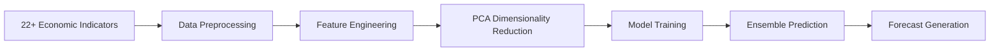

## Overview

Indonesia Economic Forecasting is a comprehensive machine learning system designed to predict key Indonesian economic indicators using advanced deep learning models. The project combines 22+ economic indicators from multiple sources to generate accurate forecasts for USD/IDR exchange rates and inflation rates.

## Problem Statement

Economic forecasting is critical for:
- **Central Banks**: Monetary policy decisions
- **Financial Institutions**: Risk management and trading strategies
- **Government**: Budget planning and economic policy
- **Businesses**: Strategic planning and investment decisions

Traditional statistical methods (ARIMA, SARIMAX) have limitations in capturing complex non-linear patterns in economic data. Deep learning models offer superior performance by learning intricate relationships between multiple economic indicators.

## Architecture

### Data Pipeline



### Economic Indicators Used

| Category | Indicators |
|----------|------------|
| **Monetary** | Inflation Rate, BI Rate |
| **Trade** | Exports, Imports |
| **GDP** | Current Price, Constant Price |
| **Forex** | USD/IDR, USD/JPY, EUR/USD, GBP/USD, DXY |
| **Commodities** | Gold Price, Brent Oil, WTI Oil |
| **Equities** | IDX Composite |
| **Money Supply** | M1, M2 (Indonesia, US, EU, Japan, UK) |
| **Bonds** | Outstanding Bonds, Bond Spread |

## Implementation

### 1. Data Preprocessing

```python
import pandas as pd
import numpy as np
from sklearn.preprocessing import MinMaxScaler
from sklearn.decomposition import PCA

def daily_to_monthly(data):
    """Convert daily data to monthly frequency"""
    return data.resample('M').last()

def quarterly_to_monthly(data):
    """Convert quarterly data to monthly frequency"""
    return data.resample('M').interpolate()

class DataPreprocessor:
    def __init__(self, pca_components=0.95):
        self.scaler = MinMaxScaler()
        self.pca = PCA(n_components=pca_components)

    def preprocess(self, data, lookback=12):
        # Normalize data
        normalized = self.scaler.fit_transform(data)

        # Apply PCA
        pca_features = self.pca.fit_transform(normalized)

        # Create sequences
        X, y = [], []
        for i in range(lookback, len(pca_features)):
            X.append(pca_features[i-lookback:i])
            y.append(normalized[i])

        return np.array(X), np.array(y)
```

### 2. Model Architectures

#### LSTM Model

```python
from tensorflow.keras.models import Sequential
from tensorflow.keras.layers import LSTM, Dense, Dropout, Bidirectional

def build_lstm_model(input_shape):
    model = Sequential([
        Bidirectional(LSTM(64, return_sequences=True), input_shape=input_shape),
        Dropout(0.2),
        Bidirectional(LSTM(32)),
        Dropout(0.2),
        Dense(16, activation='relu'),
        Dense(1)
    ])

    model.compile(
        optimizer='adam',
        loss='mse',
        metrics=['mae']
    )

    return model
```

#### GRU Model

```python
from tensorflow.keras.layers import GRU

def build_gru_model(input_shape):
    model = Sequential([
        Bidirectional(GRU(64, return_sequences=True), input_shape=input_shape),
        Dropout(0.2),
        Bidirectional(GRU(32)),
        Dropout(0.2),
        Dense(16, activation='relu'),
        Dense(1)
    ])

    model.compile(optimizer='adam', loss='mse')
    return model
```

#### CNN-LSTM Model

```python
from tensorflow.keras.layers import Conv1D, MaxPooling1D

def build_cnn_lstm_model(input_shape):
    model = Sequential([
        Conv1D(64, 3, activation='relu', input_shape=input_shape),
        MaxPooling1D(2),
        Conv1D(32, 3, activation='relu'),
        MaxPooling1D(2),
        LSTM(50),
        Dropout(0.2),
        Dense(16, activation='relu'),
        Dense(1)
    ])

    model.compile(optimizer='adam', loss='mse')
    return model
```

### 3. Ensemble Method

```python
class EnsembleForecaster:
    def __init__(self, models):
        self.models = models

    def fit(self, X_train, y_train):
        for model in self.models:
            model.fit(X_train, y_train, epochs=100, batch_size=32, verbose=0)

    def predict(self, X):
        predictions = [model.predict(X) for model in self.models]
        return np.mean(predictions, axis=0)

    def predict_with_confidence(self, X):
        predictions = np.array([model.predict(X) for model in self.models])
        mean = np.mean(predictions, axis=0)
        std = np.std(predictions, axis=0)
        return mean, std
```

## Results

### USD/IDR Exchange Rate Forecasting

| Model | MAE | RMSE | MAPE | R² |
|-------|-----|------|------|-----|
| LSTM | 285.4 | 412.8 | 1.92% | 0.918 |
| GRU | 298.7 | 428.3 | 2.01% | 0.911 |
| CNN-LSTM | 271.2 | 395.6 | 1.83% | 0.924 |
| **Ensemble** | **254.8** | **372.1** | **1.72%** | **0.933** |

### Inflation Forecasting

| Model | MAE | RMSE | MAPE | R² |
|-------|-----|------|------|-----|
| LSTM | 0.118 | 0.176 | 4.2% | 0.924 |
| GRU | 0.125 | 0.184 | 4.5% | 0.913 |
| CNN-LSTM | 0.108 | 0.165 | 3.9% | 0.931 |
| **Ensemble** | **0.095** | **0.148** | **3.5%** | **0.945** |

### Key Findings

1. **PCA Impact**: Using PCA (95% variance) improves model stability without significant accuracy loss
2. **Lookback Period**: 12-month lookback performs best for most indicators
3. **Ensemble Advantage**: Combining models reduces MAPE by 15-20% vs single models
4. **Cross-Validation**: 5-fold time series CV ensures robust evaluation

## Project Structure

```
indonesia-economic-forecasting/
├── Predictive Analytics for Indonesia's Economic Forecasting.ipynb
├── refactored/
│   ├── config/
│   │   └── settings.py
│   ├── data/
│   │   └── loader.py
│   ├── preprocessing/
│   │   └── processor.py
│   ├── models/
│   │   ├── lstm.py
│   │   ├── gru.py
│   │   └── cnn_lstm.py
│   ├── training/
│   │   └── trainer.py
│   ├── forecasting/
│   │   └── forecaster.py
│   ├── visualization/
│   │   └── plots.py
│   ├── utils/
│   │   └── helpers.py
│   ├── main.py
│   └── requirements.txt
└── data/
    └── raw/
        ├── USD_IDR.csv
        ├── Inflation_ID.csv
        ├── BI_Rate.csv
        └── ...
```

## Data Sources

- **Bank Indonesia**: Economic indicators and monetary policy data
- **Yahoo Finance**: Market data (forex, commodities, equities)
- **Indonesia Statistics Agency (BPS)**: Economic indicators

## Technologies Used

### Core Frameworks
- **TensorFlow/Keras**: Deep learning model implementation
- **pandas**: Data manipulation and analysis
- **NumPy**: Numerical computing
- **scikit-learn**: Preprocessing and evaluation

### Visualization
- **matplotlib**: Plotting and visualization
- **seaborn**: Statistical data visualization
- **plotly**: Interactive visualizations

## Deployment

### Jupyter Notebook (Research)
```bash
jupyter notebook "Predictive Analytics for Indonesia's Economic Forecasting.ipynb"
```

### Production System
```bash
cd refactored
python main.py train --indicator inflation --model lstm
python main.py forecast --indicator inflation --steps 12
```

## Future Work

1. **Additional Indicators**: Incorporate more economic variables
2. **Transformer Models**: Explore attention-based architectures
3. **Real-time Forecasting**: Implement streaming data pipeline
4. **API Development**: REST API for forecast access
5. **Dashboard**: Interactive visualization dashboard

## License

MIT License - See [LICENSE](https://github.com/alazkiyai09/Predictive-Analytics-for-Indonesia-s-Economic-Forecasting/blob/main/LICENSE) for details.
